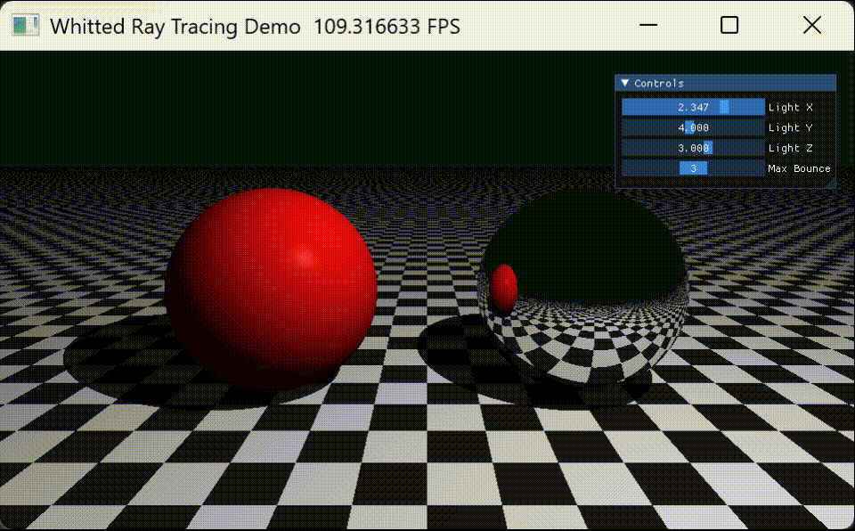

# 实验六：Taichi Whitted-Style Ray Tracing

202411180014-刘奕可-计科

## 1. 实验目标

本实验基于 Taichi 实现一个简单的 Whitted-Style 光线追踪渲染程序。程序从相机向屏幕中的每个像素发射主光线，并根据光线与场景中物体的交点计算最终颜色。

本实验主要完成以下目标：

1. 理解 Ray Casting 与 Ray Tracing 的区别。
2. 掌握 Whitted-Style 光线追踪的基本流程。
3. 实现光线与平面、球体的求交。
4. 实现硬阴影效果。
5. 实现镜面反射与多次反射。
6. 使用 Taichi Kernel 实现逐像素并行渲染。
7. 使用 UI 面板实时调节光源位置和最大反射次数。

---

## 2. 实验原理

### 2.1 Ray Casting 与 Ray Tracing

Ray Casting 主要从相机向场景发射主光线，找到光线与物体的最近交点，并根据该交点计算颜色。它通常只考虑相机光线看到的第一个表面。

Ray Tracing 在 Ray Casting 的基础上继续追踪额外光线，例如阴影光线和反射光线。本实验采用 Whitted-Style 光线追踪方法，在主光线击中物体后，会根据材质类型继续计算阴影或镜面反射。

---

### 2.2 主光线 Primary Ray

屏幕上的每个像素都会对应一条从相机出发的主光线。光线方程为：

```text
P(t) = O + tD
```

其中：

- `O` 表示光线起点，即相机位置；
- `D` 表示光线方向；
- `t` 表示光线参数；
- `P(t)` 表示光线上的一点。

程序通过计算主光线与场景中物体的交点，决定当前像素最终显示的颜色。

---

### 2.3 阴影光线 Shadow Ray

当主光线击中漫反射物体时，程序会从交点向光源方向发射一条阴影光线。

如果这条阴影光线在到达光源之前击中其他物体，说明当前点被遮挡，处于阴影中；否则该点可以被光源照亮。

阴影判断逻辑如下：

```text
if shadow ray hits object before reaching light:
    point is in shadow
else:
    point is lit
```

为了避免阴影光线刚发出就与当前表面再次相交，程序会将阴影光线的起点沿法线方向偏移一个很小的距离：

```text
P_shadow = P + N * epsilon
```

这样可以减少浮点精度问题造成的自相交黑点，也就是 Shadow Acne。

---

### 2.4 镜面反射

镜面材质不会直接显示固定颜色，而是根据入射光线和表面法线计算反射方向，并沿反射方向继续追踪光线。

反射方向公式为：

```text
R = I - 2(I · N)N
```

其中：

- `I` 为入射光线方向；
- `N` 为表面法线；
- `R` 为反射光线方向。

本实验中的银色球体设置为镜面反射材质，因此它能够反射地面、红色球体和背景颜色。

---

### 2.5 多次反射

由于 Taichi Kernel 中不适合直接使用递归函数，本实验使用循环模拟递归光线追踪过程。

基本流程如下：

```text
throughput = 1
final_color = 0

for bounce in max_bounces:
    trace ray

    if ray misses:
        final_color += throughput * background_color
        break

    if hit diffuse object:
        final_color += throughput * local_lighting
        break

    if hit mirror object:
        throughput *= reflectivity
        ray = reflected_ray
        continue
```

其中 `throughput` 表示光线能量的衰减。每发生一次镜面反射，光线能量都会乘以反射率，从而模拟反射过程中的能量损失。

---

## 3. 实验内容

本实验搭建了一个包含地面、漫反射球体和镜面球体的三维场景。

| 对象 | 材质 | 说明 |
|---|---|---|
| 无限大平面 | 漫反射材质 | 位于 `y = -1.0`，表面使用黑白棋盘格纹理 |
| 红色球体 | 漫反射材质 | 位于场景左侧，用于展示漫反射和阴影效果 |
| 银色球体 | 镜面反射材质 | 位于场景右侧，用于展示反射效果 |
| 点光源 | 白色光源 | 位置可通过 UI 面板实时调节 |
| 相机 | 固定视角 | 从前方向场景发射主光线 |

---

## 4. 项目结构

```text
taichi-raytracing-homework/
├── README.md
├── pyproject.toml
├── uv.lock
├── .gitignore
├── docs/
├── p0/
│   └── raytracing.gif
└── src/
    ├── __init__.py
    ├── main.py
    ├── app.py
    ├── config.py
    ├── geometry.py
    ├── shading.py
    └── math_utils.py
```

各文件作用如下：

| 文件 | 作用 |
|---|---|
| `main.py` | 程序入口 |
| `app.py` | 创建 Taichi 窗口、GUI 面板和主循环 |
| `config.py` | 保存窗口大小、相机、物体、光源和材质参数 |
| `geometry.py` | 实现光线与平面、球体的求交 |
| `shading.py` | 实现阴影、局部光照和多次反射追踪 |
| `math_utils.py` | 提供向量归一化、反射方向和颜色限制等工具函数 |
| `p0/raytracing.gif` | 存放实验运行效果 GIF |

---

## 5. 核心实现

### 5.1 射线与平面求交

地面使用无限大平面表示，平面高度为：

```text
y = -1.0
```

当光线方向不与平面平行时，可以通过以下公式计算交点参数：

```text
t = (plane_y - O.y) / D.y
```

如果 `t > 0`，说明交点位于相机前方，是有效交点。

---

### 5.2 射线与球体求交

球体由球心 `C` 和半径 `r` 定义，球面方程为：

```text
|P - C|² = r²
```

将光线方程代入球面方程：

```text
P(t) = O + tD
```

可以得到关于 `t` 的二次方程。程序通过判别式判断光线是否与球体相交。

如果存在两个交点，程序选择距离相机最近且位于相机前方的交点。

---

### 5.3 最近交点选择

一条光线可能同时与多个物体相交。为了保证遮挡关系正确，程序会比较所有有效交点的距离，并选择最近的交点作为当前像素对应的表面点。

核心逻辑如下：

```text
if hit and t < closest_t:
    update closest hit
```

这样可以保证前方物体正确遮挡后方物体。

---

### 5.4 棋盘格纹理

地面使用黑白棋盘格纹理。程序根据交点的 `x` 和 `z` 坐标计算当前所在格子：

```text
pattern = floor(x * scale) + floor(z * scale)
```

如果 `pattern` 为偶数，则使用一种颜色；如果为奇数，则使用另一种颜色，从而形成棋盘格效果。

---

### 5.5 硬阴影实现

在计算漫反射物体颜色时，程序会从交点向光源发射阴影光线。

如果阴影光线在到达光源前击中其他物体，则当前点处于阴影中，只保留环境光；否则计算漫反射和高光颜色。

该方法得到的阴影边缘清晰，因此称为硬阴影。

---

### 5.6 镜面反射实现

当光线击中银色镜面球时，程序会根据反射公式计算新的光线方向，并继续追踪。

镜面球本身不直接使用普通漫反射颜色，而是显示反射方向上看到的场景颜色，因此可以在镜面球上看到地面和其他物体的反射效果。

---

## 6. UI 参数设计

程序提供了以下可调节参数：

| 参数 | 作用 |
|---|---|
| `Light X` | 控制光源在 x 方向的位置 |
| `Light Y` | 控制光源在 y 方向的位置 |
| `Light Z` | 控制光源在 z 方向的位置 |
| `Max Bounce` | 控制最大反射次数 |

通过调节光源位置，可以观察阴影方向、阴影长度和明暗变化。

通过调节最大反射次数，可以观察镜面反射效果的变化：

- 当 `Max Bounce = 1` 时，反射次数不足，镜面球反射效果较弱；
- 当 `Max Bounce > 1` 时，光线可以继续沿反射方向传播，镜面球能够显示更完整的反射内容；
- 反射次数越多，画面效果越丰富，但计算量也会增加。

---

## 7. 实验结果

程序最终渲染出一个包含黑白棋盘格地面、红色漫反射球和银色镜面反射球的三维场景。

红色球体可以展示漫反射光照和硬阴影效果；银色球体可以展示镜面反射效果；地面棋盘格可以帮助观察空间透视、阴影位置和镜面反射内容。

### 实验输出图

效果展示如下：

<p align="center">
  
</p>

---

## 8. 实验分析

通过实验可以观察到：

1. 主光线决定每个像素首先看到的物体。
2. 阴影光线可以判断交点是否被其他物体遮挡。
3. 镜面反射需要继续追踪反射方向上的光线。
4. `throughput` 可以模拟光线在多次反射过程中的能量衰减。
5. 使用循环代替递归更适合在 Taichi GPU Kernel 中实现。
6. 对阴影光线和反射光线的起点添加微小偏移，可以减少自相交导致的黑点问题。
7. 最大反射次数越大，反射效果越完整，但渲染计算量也越大。

---

## 9. 实验总结

本实验完成了一个基于 Taichi 的 Whitted-Style 光线追踪渲染程序，实现了主光线生成、平面求交、球体求交、最近交点选择、棋盘格纹理、硬阴影、镜面反射和多次反射追踪等功能。

通过本实验，我进一步理解了 Ray Casting 与 Ray Tracing 的区别，掌握了阴影光线和反射光线的基本实现方法。同时，借助 Taichi 的并行计算能力，程序可以将逐像素光线追踪过程放入 Kernel 中执行，实现较高效率的实时渲染。

整体来看，本实验较好地完成了作业要求，实现了地面、红色漫反射球、银色镜面球、硬阴影、多次反射以及 UI 参数调节等功能。
